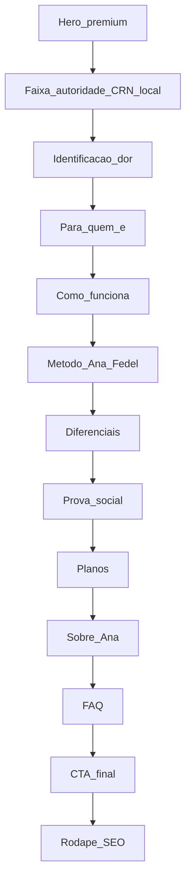

# Plano de implementação — Site Ana Fedel

**Fonte:** auditoria-site-ana-fedel.md  
**Entregável no repo:** este documento na raiz do projeto (junto a `index.html`).

## Diretrizes confirmadas

- **CTA principal:** Google Calendar (manter `.gcal-schedule-host`).
- **CTA secundário:** WhatsApp com mensagem pré-preenchida.
- **Estilo visual:** manter identidade atual (paleta, tipografia e composição).
- **Escopo da homepage:** `index.html` com melhorias pequenas, pontuais e de baixo risco.

---

## Objetivo

Elevar clareza, conversão e SEO sem redesign:

1. fortalecer promessa no topo;
2. melhorar caminho até agendamento/WhatsApp;
3. aumentar autoridade (CRN, local, prova social);
4. abrir crescimento orgânico com páginas SEO.

---

## Fase 1 — Ajustes pontuais na home

**Arquivos:** `index.html`, `styles.css`

- Ajustar hero (headline, subheadline, CRN/local, CTA principal + secundário).
- Padronizar CTAs para `Agendar minha consulta`.
- Incluir botão claro `Falar comigo` com link WhatsApp.
- Reforçar seções de valor (para quem é, diferenciais, método, planos).
- Manter depoimentos como placeholder até autorizações.
- Expandir FAQ comercial e sincronizar JSON-LD.
- Inserir `LocalBusiness` no schema mantendo estrutura atual.
- Melhorias de performance sem alterar visual.

---

## Fase 2 — SEO e captação

**Arquivos novos (estáticos):**

- `nutricionista-em-campinas.html`
- `emagrecimento-feminino.html`
- `saude-hormonal-feminina.html`
- `consulta-online.html`
- `reeducacao-alimentar.html`
- `bioimpedancia-campinas.html`
- `links.html`

**Arquivo atualizado:**

- `sitemap.xml` com todas as URLs publicadas.

---

## Fase 3 — Quando conteúdo estiver pronto

- Substituir placeholders por depoimentos autorizados.
- Atualizar fotos profissionais.
- Ativar lead magnet.
- Ativar GA4 com ID real.
- Opcional: mapa na página local com endereço completo.

---

## Critérios de aceite

- Home mantém o estilo atual (sem redesign).
- `index.html` alterada de forma incremental.
- CTA principal permanece Calendar.
- Botão/links de WhatsApp funcionam com mensagem pronta.
- FAQ e schema alinhados.
- `sitemap.xml` inclui páginas SEO publicadas.

---

## Pendências de conteúdo

- Depoimentos autorizados.
- Endereço completo (se for publicar).
- Fotos novas.
- ID do Google Analytics 4.
# Plano de implementação — Site Ana Fedel

**Fonte:** [auditoria-site-ana-fedel.md](auditoria-site-ana-fedel.md)

**Entregável no repo:** este documento na raiz do projeto (junto a `index.html`).

**Stack atual:** site estático (`index.html` + [`styles.css`](styles.css)), hospedagem GitHub Pages (`CNAME` → anafedel.com). Sem build step — cada página SEO será um HTML independente com header/rodapé reutilizados por cópia consistente.

**Decisões confirmadas:**
- **CTA principal:** Google Calendar (manter hosts `.gcal-schedule-host` existentes).
- **CTA secundário:** WhatsApp com mensagem pré-preenchida + botão fixo no mobile.
- **Conteúdo:** CRN e localização disponíveis; depoimentos e fotos novas chegam depois (estrutura com placeholder).
- **Diretriz de design:** manter o estilo visual atual do site (paleta, tipografia, composição e identidade); evitar redesign.
- **Escopo da homepage:** a `index.html` deve receber apenas melhorias pontuais e pequenas modificações, preservando a estrutura base já existente.

---

## Diagnóstico: audit vs. código atual

| Recomendação da auditoria | Estado em [`index.html`](index.html) |
|---|---|
| Hero com promessa específica (emagrecimento feminino) | Ainda: *"Nutrição com ciência, escuta e estratégia"* |
| CRN + Campinas/Cambuí no topo | Só no rodapé, sem CRN |
| Seção de diferenciais pós-hero | Ausente |
| Seção "Para quem é" em bullets emocionais | Existe como grid de especialidades (tom descritivo, não dor) |
| "Método Ana Fedel" nomeado | Seção `#metodo` genérica |
| Prova social antes dos planos | Ausente |
| Planos com "para quem" + selo 3 meses | Lista de entregáveis; `featured` existe mas sem copy comercial |
| FAQ comercial expandido | 4 perguntas |
| WhatsApp na jornada | Só no footer (`wa.me/5519992591776`) |
| Páginas SEO (`/nutricionista-em-campinas`, etc.) | One-page; [`sitemap.xml`](sitemap.xml) só tem `/` |
| Schema LocalBusiness | Só `Dietitian` + `FAQPage` |
| Botão fixo mobile | Ausente |
| Imagens WebP / performance | Hero em JPG; alguns `.webp` em `img/` |

**CTAs atuais:** 5 instâncias de `gcal-schedule-host` (hero, 2 planos, sobre, CTA final). Labels variam ("Agende agora", "Agendar") — padronizar conforme auditoria.

---

## Arquitetura alvo da homepage (sem redesign)

Aplicar ajustes pontuais para reforçar a jornada mobile da auditoria (seção 12), preservando o visual atual:



**Nav:** expandir [`header`](index.html) com links âncora (`#planos`, `#metodo`, `#faq`) + botão compacto "Agendar" (dispara o mesmo Calendar do hero).

---

## Fase 1 — Alto impacto (1–2 sessões de dev, sem alterar o estilo base)

### 1.1 Hero, meta e autoridade

**Arquivos:** [`index.html`](index.html) (head + hero), [`styles.css`](styles.css)

| Elemento | Copy sugerida (auditoria §8) |
|---|---|
| `<title>` | Nutricionista em Campinas \| Emagrecimento Feminino e Saúde Hormonal — Ana Fedel |
| `meta description` | Nutricionista em Campinas e online. Atendimento personalizado para mulheres que desejam emagrecer, melhorar sintomas hormonais e cuidar da saúde com estratégia e leveza. |
| H1 | Emagrecimento feminino com estratégia, leveza e acompanhamento individualizado. |
| Subheadline | Atendimento nutricional para mulheres que querem emagrecer, melhorar sintomas, cuidar da saúde hormonal e construir uma rotina alimentar possível — sem dietas extremas e sem culpa. |
| Faixa abaixo do eyebrow | Atendimento online e presencial em Campinas — Cambuí · CRN 91723 |
| CTA primário (Calendar) | `data-gcal-label="Agendar minha consulta"` |
| CTA secundário | Link âncora `#planos` — "Conhecer os planos" (botão outline novo em CSS) |

Atualizar também `og:title`, `og:description`, `twitter:*` e JSON-LD `description` para alinhar.

### 1.2 Ajustes de seções e copy (mudanças pequenas)

Todas em [`index.html`](index.html) + classes novas em [`styles.css`](styles.css), com alterações pontuais:

1. **`#identificacao`** — título tipo *"Você sente que faz tudo certo e mesmo assim não evolui?"* + 1 parágrafo de empatia.
2. **Reescrever `#especialidades` → `#para-quem`** — título *"Esse acompanhamento é para você que…"* + lista de 6 bullets (auditoria §8).
3. **Manter `#processo`** (Como funciona) — copy levemente mais orientada a transformação.
4. **Renomear/reescrever `#metodo`** — título *"O Método Ana Fedel une ciência, escuta e estratégia clínica"* + texto da auditoria; manter foto do consultório.
5. **`#diferenciais`** — grid 6 itens: investigação clínica, plano na rotina, exames, WhatsApp, bioimpedância, sem terrorismo nutricional.
6. **`#depoimentos`** — 2–3 cards com estrutura pronta; texto placeholder discreto (*"Depoimentos em breve"*) até Ana enviar prints autorizados. Incluir frase-resumo da auditoria: *"Pacientes relatam uma experiência acolhedora…"*
7. **Reescrever `#planos`** — subtítulos *"Para começar com clareza"* / *"Para evoluir com acompanhamento"*; badge *"Mais recomendado para resultados consistentes"* no Transformar; CTA Calendar: *"Quero iniciar meu acompanhamento"*.
8. **Expandir `#faq`** — adicionar 6 perguntas comerciais (auditoria §11.4): tempo de resultado, plano difícil?, emagrecimento, rotina corrida, consulta única vs 3 meses, recibo reembolso. **Sincronizar** entradas no bloco `FAQPage` do JSON-LD.
9. **CTA final** — copy: *"Pronta para cuidar do seu corpo com mais estratégia, leveza e acompanhamento?"* + Calendar + link WhatsApp *"Falar com a Ana pelo WhatsApp"*.

### 1.3 WhatsApp secundário (sem substituir Calendar)

Constantes em script (ou `data-*` nos links):

```text
Geral:  https://wa.me/5519992591776?text=Olá%2C%20Ana!%20Vim%20pelo%20site%20e%20gostaria%20de%20saber%20mais%20sobre%20o%20acompanhamento%20nutricional.
Plano Transformar: ...Tenho%20interesse%20no%20Plano%20Transformar%20de%203%20meses...
```

- Botão fixo mobile (`.whatsapp-float`) — visível só `max-width: 768px`, `bottom` com `safe-area`, não sobrepor conteúdo crítico (`z-index` abaixo do modal Calendar).
- Repetir link WhatsApp no hero (secundário) e CTA final.

### 1.4 UX mobile e navegação

- Header sticky com logo + "Agendar" (scroll → `.scrolled` já existe).
- Cards de planos: em mobile, reduzir padding e garantir botão Calendar full-width em cada card.
- Opcional Fase 1: bloco **3 FAQ em destaque** (accordion compacto) imediatamente antes de `#planos` — link "Ver todas" → `#faq`.

### 1.5 SEO técnico rápido (mesma fase)

- JSON-LD: adicionar `LocalBusiness` / `MedicalBusiness` com endereço Cambuí, `telephone`, `geo` (se coordenadas disponíveis), `openingHours` se aplicável; ligar a `#profissional`.
- Rodapé: linha SEO *"Nutricionista em Campinas · Atendimento online · Cambuí"*.
- Revisar hierarquia: **um H1** no hero; demais seções com H2.

### 1.6 Performance (checklist §9)

| Ação | Detalhe |
|---|---|
| Hero WebP | Gerar `hero-ana-fedel-1600.webp` + `<picture>` com fallback JPG; manter `preload` na variante principal |
| Dimensões | Garantir `width`/`height` em todas as `` (já no hero; aplicar em `branca.jpg`, `consultorio`) |
| Lazy load | Manter em imagens abaixo da dobra; hero `fetchpriority="high"` |
| `consultorio.PNG` | Converter para WebP/JPG otimizado |
| Fontes | Manter 2 famílias; avaliar remover pesos não usados do Google Fonts URL |
| Loader | Manter; garantir que não atrase LCP além do necessário (já tem timeout 8s) |

Meta: LCP < 2,5s mobile, CLS < 0,1.

---

## Fase 2 — SEO e captação (curto prazo)

### 2.1 Páginas de serviço (HTML estáticos)

Criar na raiz, cada uma com ~600–900 palavras, H1 único, CTA Calendar + WhatsApp, link "Voltar ao site":

| Arquivo | Foco |
|---|---|
| `nutricionista-em-campinas.html` | SEO local (prioridade máxima) |
| `emagrecimento-feminino.html` | Serviço + conversão |
| `saude-hormonal-feminina.html` | Autoridade SOP/menopausa |
| `consulta-online.html` | Captação nacional |
| `reeducacao-alimentar.html` | Evergreen |
| `bioimpedancia-campinas.html` | Busca local específica |

**Padrão de página:** reutilizar `<head>` meta únicos, nav/footer iguais ao index, conteúdo em `<main>`, breadcrumb simples, link interno para `#planos` na home.

**Atualizar:** [`sitemap.xml`](sitemap.xml) com todas as URLs + `lastmod`; conferir [`robots.txt`](robots.txt).

### 2.2 Página `/links` (Instagram)

Arquivo `links.html` (ou `links/index.html` se preferir URL limpa `/links/` no GitHub Pages):

- Agendar (Calendar)
- Ver planos (home#planos)
- WhatsApp
- Depoimentos (home#depoimentos)
- Consulta online (página dedicada)
- Placeholder "Baixar guia" (desabilitado até Fase 3)

Estilo: página minimalista, mobile-first (tipo Linktree alinhado à marca).

### 2.3 Mapa e NAP

Se endereço completo do consultório estiver disponível:

- Embed Google Maps na página Campinas + endereço textual no rodapé (consistência NAP para SEO local).
- Documentar checklist Google Business Profile (ação fora do código — na Ana).

---

## Fase 3 — Estratégico (médio prazo)

| Item | Abordagem |
|---|---|
| **Depoimentos reais** | Substituir placeholders por cards com iniciais + texto autorizado; considerar `depoimentos.html` |
| **Fotos profissionais** | Trocar `hero-ana-fedel-1600.jpg`, `branca.jpg` quando entregues |
| **Lead magnet** | PDF + formulário (Formspree/Netlify Forms/Google Form) — nova seção ou popup; link na `/links` |
| **Blog** | Pasta `blog/` com índice + posts em Markdown→HTML ou páginas estáticas; temas da auditoria §13 |
| **Analytics** | Snippet GA4 + eventos `click_whatsapp`, `click_agendar` (documentar no README interno) |
| **Landing plano trimestral** | Opcional: `plano-transformar.html` |
| **Calculadora de plano** | Opcional; baixa prioridade |

---

## Conteúdo necessário da Ana (bloqueios)

| Item | Fase | Status |
|---|---|---|
| Número CRN completo | 1 | Disponível — inserir no hero/rodapé/schema |
| Endereço Cambuí (rua, nº se público) | 1–2 | Parcial — confirmar o que pode ir no site |
| 2–4 depoimentos autorizados | 1 (placeholder) → 2 | Pendente |
| Fotos novas hero/sobre | 3 | Pendente |
| PDF lead magnet | 3 | Pendente |

---

## Arquivos principais a tocar

| Arquivo | Mudanças |
|---|---|
| [`index.html`](index.html) | Pequenas modificações de copy, CTA, FAQ, schema e pontos de conversão (sem redesign) |
| [`styles.css`](styles.css) | Ajustes pontuais de componentes já existentes (sem mudança de identidade visual) |
| `nutricionista-em-campinas.html` (+ 5 páginas) | Novos |
| `links.html` | Novo |
| [`sitemap.xml`](sitemap.xml) | Novas URLs |
| `img/*` | Novos WebP otimizados |
| [`PLANO-IMPLEMENTACAO-SITE.md`](PLANO-IMPLEMENTACAO-SITE.md) | Este plano |

**Fora do escopo de código:** Google Business, campanhas pagas, sequência de e-mail pós-lead.

---

## Ordem de execução recomendada

1. Hero + meta + faixa CRN/local + CTAs padronizados  
2. Reordenar seções + novas seções (identificação, diferenciais, depoimentos placeholder)  
3. Reescrever planos, método, FAQ + JSON-LD  
4. WhatsApp float + links com `?text=`  
5. Performance imagens  
6. Página `nutricionista-em-campinas.html` + sitemap  
7. Demais páginas SEO + `links.html`  
8. Depoimentos/fotos reais quando prontos  

---

## Critérios de aceite

- Visitante mobile entende em 5s: para quem, o quê, onde (Campinas/online), como agendar.
- Calendar permanece CTA primário em hero, planos, sobre e CTA final.
- WhatsApp acessível sem rolar (botão fixo mobile) com mensagem pré-preenchida.
- Lighthouse mobile: Performance e SEO ≥ 90 (aspiracional; registrar baseline antes/depois).
- `sitemap.xml` lista todas as páginas publicadas.
- FAQ visível e expandido; schema FAQ sincronizado.
- Estilo visual do site atual é mantido (sem redesign da homepage).
- Alterações na `index.html` permanecem pequenas, incrementais e de baixo risco.
